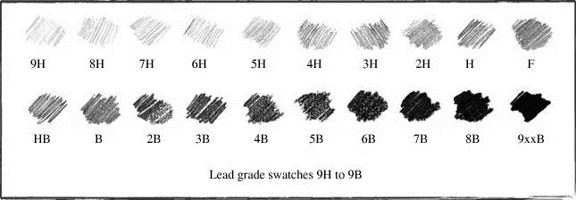
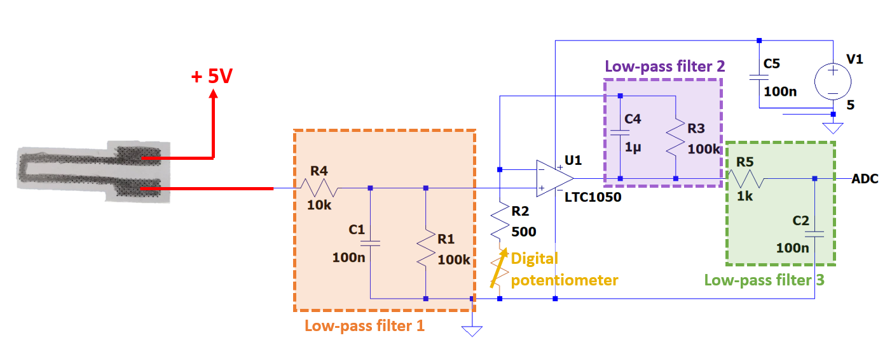
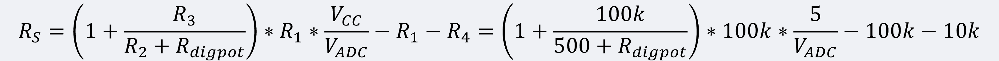
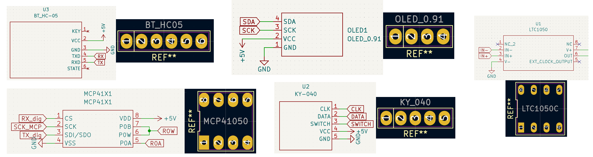
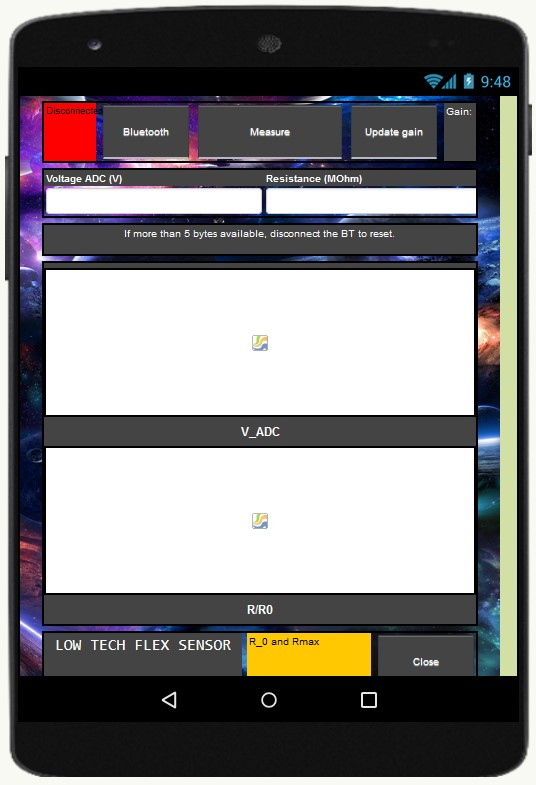

2021_2022_Grindal_Mariez_graphite_flex_sensor_project

# Objective of the project
The objective of the project is to design and build a PCB shield including a **low-tech graphite strain sensor** coupled to an analog electronic circuit that communicates data via a microcontroller to an Android application. The aim of this project is to get the resistance from a graphite sensor to measure a deformation, to analyze the results obtained and to describe the characteristics of the sensor in a datasheet.

# Main steps of the project
   [1. Graphite sensor conception](#1-graphite-sensor-conception)\
   [2. Electrical conception and simulation on *LTSpice*](#2-electronic-conception-and-test-on-lt-spice)\
   [3. PCB conception and printing](#3-pcb-conception-on-kicad)\
   [4. Arduino code](#4-arduino-code)\
   [5. Application ANDROID](#5-apk-application)\
   [6. Test bed](#6-test-bed)\
   [7. Datasheet](#7-datasheet)

# 1. Graphite sensor conception
The first step is to make the graphite sensor with paper and a pencil. Pencil cores and lead mines used in mechanical pencils consist of a mixture clay and tiny scales of graphite that can slide on top of each other. The sensor outline is printed on a piece of thick printing paper, and the remaining work is simply to cut it out and fill in the dotted "U" shape with a pencil, as shown on the image below. 

 

    
The upside is that is allows to adjust the amount of graphite by adding or erasing the pencil mark containing graphite. The downside is the difficulty of reproducing the same sensor with the same graphite layer thickness and density of graphite. An additional problem regarding graphite is presented below.

    

   
**Graphite grading scale problem**
    

 
    
There exists different graphite grading scales, with the numerical scale and the HB scale the two most widely used. The HB scale goes from 9B to 9H, “H” to indicate a hard pencil and “B” to designate the blackness of the pencil’s mark, indicating a softer lead and a higher proportion of graphite.
    
The problem when trying to reproduce a sensor is the lack of a specific industry standard for the darkness of the mark to be left within the HB or any other hardness grade scale. That implies that a HB pencil from one brand will not necessarily leave the same mark as a HB pencil from another brand. Most manufacturers set their own internal standards for graphite hardness grades and some differences are regional. For example in Japan, consumers tend to prefer softer darker leads, so an HB lead produced in Japan is generally softer and darker than an HB from European producers.
    
Specifying the exact product and manufacturer in addition to the graphite grading can increase the reproductibilty of the sensor.
> This project uses graphite from BIC Criterium 550 pencils with the gradings 6B, 4B, B, H and 3H. Special STEIN HB lead mines from Pentel is also used. STEIN stands for "Strongest Technology by Enhanced SiO2 Integrated Network" and have a 10 % denser core than an average HB lead mine. This can result in a different resistance range than a normal HB pencil despite applying it the same way with the same thickness etc.

    
# 2. Electronic conception and test on LT-Spice
The second step is to build the electrical circuit adapted to our case. Strain sensor is a passive sensor and needs a conditionner. The output signal od the sensor is very low and can be easily interfered by noise (from the circuit or external noise). The aim of this part is to chose the good components to have the good filters and amplifiers. We also have to take into account the chracteritic of the arduino uno card we are gonna use:
* Resolution 10 to 12 bits (1024 à 4096 points)
* Full scale (VRef) : 1.1 V to 5.0 V
* Max source impedance 1 kOhm to 10 kOhm
* Max sampling frequency 15 kHz to 2.4 MHz
 
Graphite sensor is supplied by 5V and gives resistance values between 20MΩ and 100MΩ. Direct measurement of a 100 nA current does not seem feasible. We have to amplifiy the signal and to filter it.
The final electrical circuit chosen is the following:

 
### Role of different components:
> R5 at the input protects the operational amplifier against electrostatic discharges (ESD), and together with C1 makes up a filter for voltage noises
> 
> C1 with R1 makes up a filter for the current noise
>
> R2 is replaceable, in order to allow an adaptaion of the full scale range (digital potentiometer)
>
> C4 with R3 makes up the active filter
>   
> C2 with R6 makes up the passive output filter
>   
> C3 filters out the power supply noise
>   
> The digital potentiometer MCP41050 can change the gain and adapt it to the resistance value from the graphite sensor. Resistance of the digital potentiometer can vary between 330Ω and 50kΩ based on datasheet. 
 
### Sensor resistance calculation:

 
### Low-pass filters
> For each electrical stage, we can simulate the cuttoff frequency by putting the capacity of each filter at zero:
> * Low-pass filter 1 (C4 = C2 = 0) : 16kHz\
>      To select signals with frequency less than 10*1.5kHz (sample frequency of the arduino card) to respect Shannon criteria
> * Low-pass filter 2 (C1 = C2 = 0) : 2,1 kHz\
>      To filter noises from sector of the power supply at 50 Hz
> * Low-pass filter 3 (C1 = C4 = 0) : 1,6 kHz\
       To filter global external noises of volateg and current
 
### Main characteristics of the electrical circuit
> Global gain: from 3.13 to 127.9
>
> Global attenuation of a 50 Hz current noise: 100dB or 10e5
>
> Offset of the LTC1050 is about 5 µV wich is acceptable because much lower than the voltage measured to ouputs of the resistance R1 of 10mV (and the maximum offset voltage drift is about 0.05μV/°C).

### Simulations on *LT-Spice*
> We simulate on *LT-Spice* 
> The transient simulation with resistance R2 varying between 100Ω and 2kΩ (step of 100Ω) gives the curves below.
>     

> If we simulate the impact of the noise from sector (50 Hz), we obtain the curves below. 

The folder "2021_2022_Grindal_Mariez//" contains the LT-Spice files used into different simulations. 

# 3. PCB conception on _KiCad_
Once the electrical circuit is done, we have to make the PCB conception to get the final circuit. First, we did the schematic in *KiCad*. Then, we build the PCB plane by adding the references and dimensions of each components. The final step is to print the PCB card with different processes.
Circuit conception was made on *KiCad*. 
### Circuit schematic on *KiCad*
> The electrical circuit was made in KiCad. All pins and connections are established. For each components, we have to associate the print. For LTC1050, rotary encoder, digital potentiometer and OLED screen, we have to create our own print in our own library. The schematic is made from a model with Arduino Uno shield to have directtly the right pins and the good dimensions of the card.
>  

    
### PCB conception on _KiCad_
> After doing the schematic, we draw the PCB with the previous dimensions :
> * Track length = 0.9 mm
> * Isolation width = 0.7 mm
> * Pad dimensions for OLED, Bluetooth module and rotary encoder = 2 mm * 2.5 mm
> * Drill size for OLED, bluetooth module, rotary encoder, AOP and digital potentiometer = 1 mm
> * Pad size for AOP and digital potentiometer = 1.8 mm * 2.5 mm
> * Drill size for resistances and capacities = 2 mm
> * Pad size for resistances and capacities = 0.8 mm
> For each component, we have to find the print associated or to make it into a new libary (for rotary encoder, OLED screen, LTC1050 and digital potentiomter). After placing the components in the optimal way, we trace the wires and make the ground plane.
> 

 

### PCB 3D visualisation  
> 

> A 3D visualisation is possible and allowed us to well arrange components placement without spatial conflict. 

#### All *KiCad* files are in the folder "Projet2022_grindal_mariez_pcb".

### PCB printing processes
> Mask printed on transparent film (PCB plan from KICAD) 
>
> The mask is placed on a plate of copper convered with photo-sensitive film. The mask and the plate are insolated with UV. The black part of the mask protects the photo-sensitive resin from UV, and the clear zone of the mask reveals copper beacause photo-sensitive resin reacts with UV.
>
> PCB plate is washed with a developper solution (oxydied water) that reveals the PCB circuit
>
> PCB plate is placed in oxyde bath to remove the unwanted copper not protected by photo-sensitive zone left.
>
> PCB is washed and left to dry.

    
# 4. Arduino code
### Improvement potential for Arduino code
> Make the code run faster and more smoothly by optimizing menu management code. This can be done by decreasing the lines of code for the OLED display and assure the switch button on the rotary encoder, which is not connected to an interrupt pin, is detected regardless of the speed of the executing loop.  The number of variables in use for the menu, submenu and blocking the rotary encoder when needed should be reduced. Suboptimal solutions to ensure the screen is refreshed correctly can be improved upon.
>
> Decrease the time interval between two measurements, currently at 700 ms, to see how fast it can measure and decrease response time.
    
### General structure of Arduino code
>The Arduino code (.ino) is written in C++ with an addition of special methods and functions.
The main text editing program used for this project is the Arduino Integrated Development Environment (IDE). It has a clean and simple interface with the option of showing a serial monitor and a serial plotter. The serial monitor is useful for checking the outcoming bytes from the board to the digital potentiometer MCP41050 and communication with the APK application via the Bluetooth module HC-05.
    
### Libraries used 
> SoftwareSerial.h for defining serial ports on specific pins, here used with the Bluetooth module and digital potentiometer.
>
> Adafruit_GFX.h and Adafruit_SSD1306.h for the I2C OLED display SBC-OLED01.
>
> Wire.h contain the definitions for I2C pins used to communicate with the OLED display.
>
> SPI.h is used to communicate with SPI devices, with Arduino as the master device. The Serial Peripheral Interface (SPI) is a synchronous serial data protocol and is used with the digital potentiometer.

### The Arduino code is divided into four parts:
>The first lines contain inclusions (#include) of libraries, definitions (#define), which is a C++ component that allows to give a name to a constant value before the program is compiled, and declarations of global variables.
>    
>The setup() function, which initializes and sets the initial values, is executed only one time after powering on the Arduino board. 
In this case, the mode of pins on the board are initialized with pinMode(), and digitalWrite() is used to turn on the pullup resistors for the rotary encoder KY-040. Data transfer through serial ports, SPI, SoftwareSerial and Serial, is enabled.
>    
>The loop() function is the main part and runs continuously after the setup until the reset button is pressed or the power supply is cut.
    It is far from optimized and contain a lot of if-statements. First it checks to detect a change in the switch button, then checks if the APK application has asked for measurement data or an updated Rcal value to update the gain. Then it does a measurement if the interval requirement is met. The last part of the loop is a mix of rotary encoder and OLED display to make the menu and submenu options work. 
>  
>The last part is constituted of definitions of the functions used in the loop function. Six functions are defined. 
>   * The first function reads the analog pin connected to the sensor called readSensor() and returns the voltage in the range 0–5 V. 
>   * Two functions manages the digital potentiometer, setPot() and potSwiper(). setPot() changes dig. pot. position and updates Rcal and gain. potSwiper() uses setPot() and takes a float as input, with the goal to land on approximately the right voltage by running through the positions to find an adequate resistance value. 
>   * The OLEDstartup() function is simply the startup screen sequence, lasting around two seconds.
>   * The last functions doEncoderA() and doEncoderB() is attached to interrupts on both pins for the rotary encoder and includes debouncing, ensuring a rapid and accurate response to manual rotation of the encoder. The variable maxRot ensures a circular list regardless of scrolling through the menu or manually adjusting the gain.

  
# 5. APK application
The APK application, working on Android smartphones, is made with the free web application integrated development environment MIT App Inventor.The app communicates over Bluetooth with the HC-05 module mounted on the Arduino shield, and allows to measure and trace resistance and voltage over time.
Main features:
* Display measured voltage and resistance numerically and traced as a function of time
* Update gain if modified on the shield
* Save measured data points in a text file found in the paths "/savedRfile.txt" and "/savedVfile.txt"
    

 

 
# 6. Test bed
The six sensors were tested under compressive and tensile deflection on cylindrical objects with a constant diameter. The test bed consisted of seven cylindral objects with each a diameter ranging from 7 cm to 1,15 cm. The contact surface was covered in paper to minimize interactions between the object and the graphite layer on the sensor under compressive deflection.

### Test procedure
> The sensor was connected to the shield with two alligator clips. Voltage measurements indicated if the start voltage was near the extreme values of the range 0-5 V, indicating signal saturation in case of very high voltage and no current flowing in case of 0 V. Saturation of the signal was handled by choosing the "set gain" option in the menu to automatically adjust the gain to start at around 1 V. No signal was fixed by applying more graphite on the dotted area of the sensor.
>
> The R0 at zero derformation was measured when the sensor was pressed flat.
>
> Each sensor was first tested under tensile deflection, that is the graphite facing away from the curvature, with the assumption that the compressive deflection is more damaging to the sensor. The tensile deflection increases the distance between the graphite layers and decreases the measured voltage. The measurements were done in the order of decreasing diameter, starting with the smallest deformation to bend the paper sensor as little as possible to avoid detoriation.
>
> Graphite was reapplied on top of the old layer and a new R0 was measured when pressed flat.
> The same procedure was repeated for the compressive deflection with the sensor laying on a flat surface graphite layer up and bent upwards around the object while pressing the object gently downwards close to the edge of the table where the alligator clips were aligned. To avoid smearing of the graphite layer, especially for the 4B and 6B pencils, minimal friction was ensured between the sensor and the paper covered object. It is possible that smearing would have a minimal impact because the layer applied was thick. The measurements were done in the order of decreasing diameter, starting with the smallest deformation. 
>
> For compressive deflection, sudden drops in voltages occured for some of the sensors when repedately bending around the smallest objects and inducing large deformations. In those cases, graphite was reapplied on top of the old layer, a new R0 was measured when pressed flat and a new measurement series was conducted starting with the largest object.
    
# 7. Datasheet
Datesheet is providing the main characteristics and technical specifications of the strain sensor. It is in the folder "Datasheet" of the repository. 
