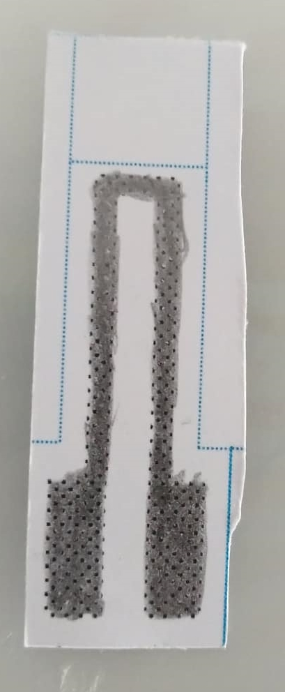
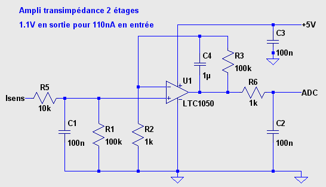
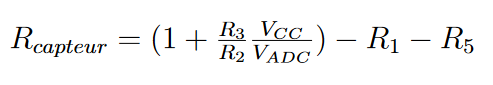
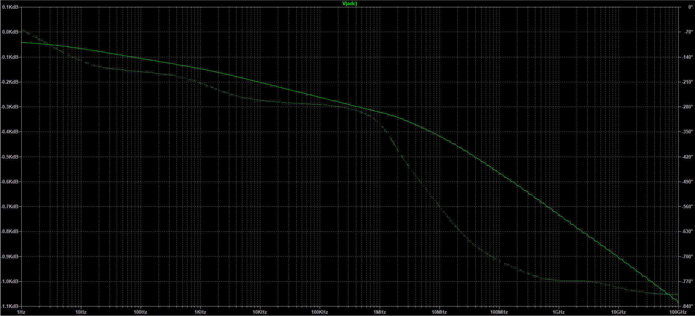
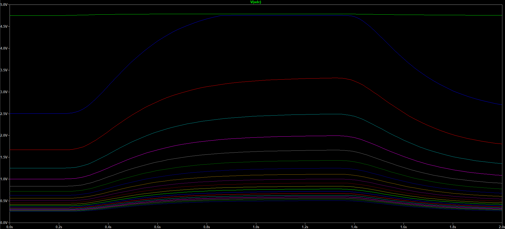
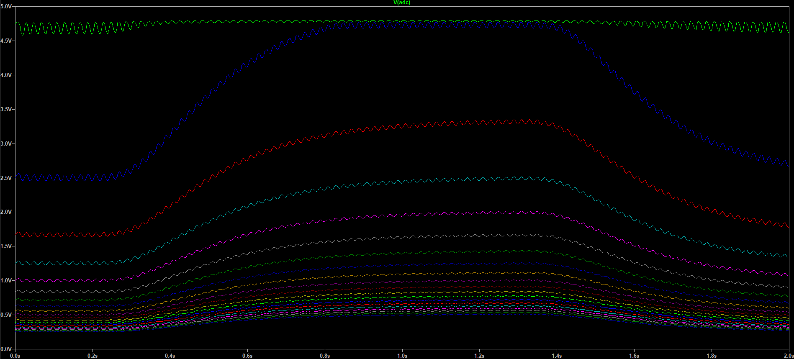
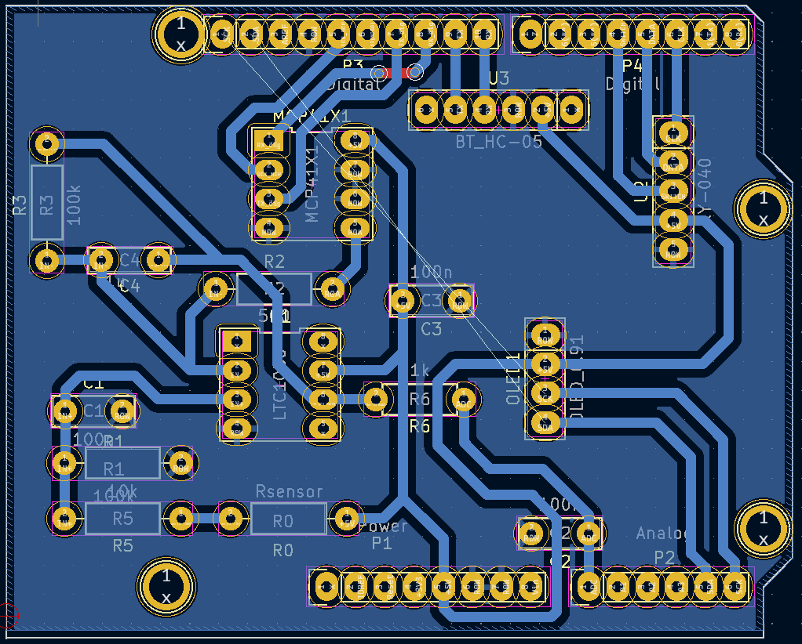
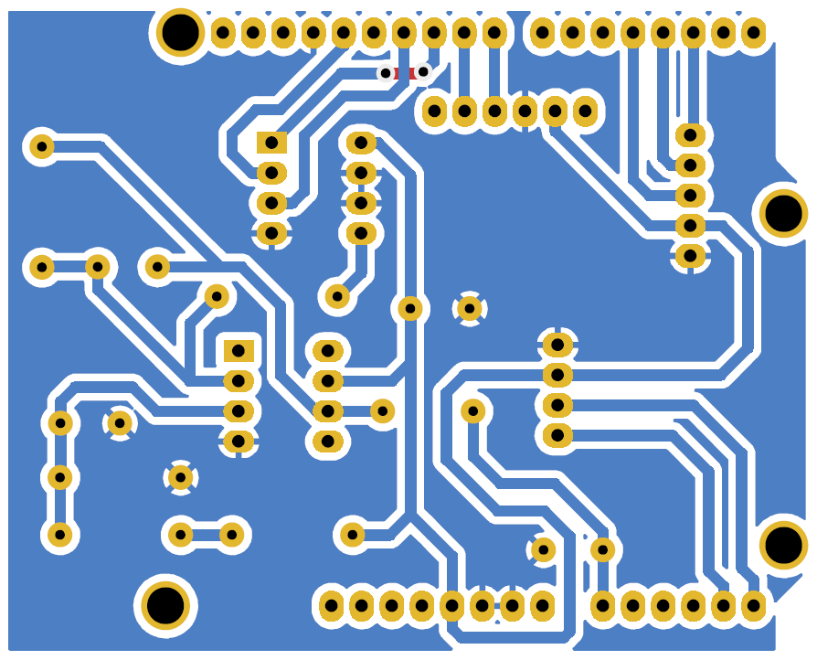
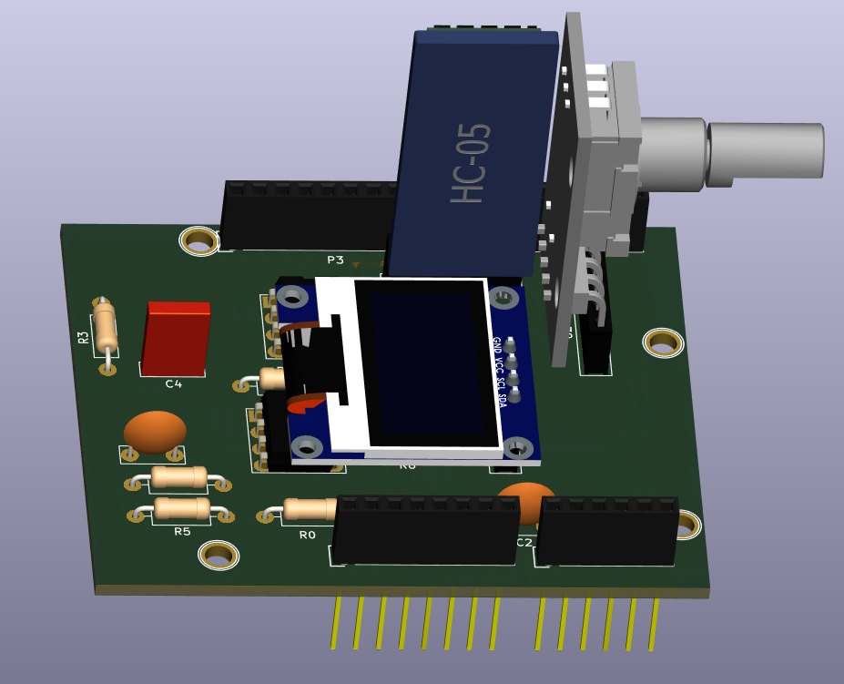
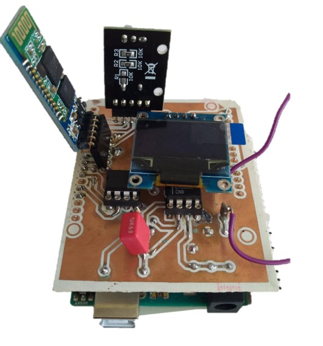

# 2021_2022_Grindal_Mariez

## Objective of the project
The objective of the project is to design and build a PCB shield including a **low-tech graphite strain sensor** coupled to an analog electronic circuit that communicate data via a microcontroller to an Android application. The aim of this project is to get the resistance from a graphite sensor to measure the deformation, to analyze the results obtained and to describe the characteristics of the sensor in a datasheet.

## Main steps of the project
* [Graphite sensor conception](#graphite-sensor-conception)
* [Electrical conception and simulation on *LTSpice*](#electronic-conception-and-test-on-lt-spice)
* [PCB conception and printing](#pcb-conception-on-kicad)
* [Arduino code](#arduino-code)
* [Application ANDROID](#application-android)
* [Test bed and critical analysis](#test-bed-and-critical-analysis)
* [Datasheet](#datasheet)

## Graphite sensor conception
The first step is to make the graphite sensor. We just cut a piece of paper and put some graphite on it with a 2B pencil as you can see on the image below.

 

    
## Electronic conception and test on LT-Spice
The second step is to build the electrical circuit adapted to our case. The aim of this part is to chose the good components to have the good filters and amplifiers because the signal from the sensor is very low and can be interfered by noise (from the circuit or external noise). We also have to take into account the chracteritic of the arduino uno card we are gonna use:
* Resolution 10 to 12 bits (1024 à 4096 points)
* Full scale (VRef) : 1.1 V to 5.0 V
* Max source impedance 1 kOhm to 10 kOhm
* Max sampling frequency 15 kHz to 2.4 MHz
 
Graphite sensor is supplied by 5V and gives resistance values between 20MΩ and 100MΩ. Direct measurement of a 100 nA current does not seem feasible. We have to amplifiy the signal and to filter it.
The final electrical circuit chosen is the following:

 
The circuit characteritics are: 
* R5 at the input protects the operational amplifier against electrostatic discharges (ESD), and together with C1 makes up a filter for voltage noises
* C1 with R1 makes up a filter for the current noise
* R2 is replaceable, in order to allow an adaptaion of the full scale range (digital potentiometer)
* C4 with R3 makes up the active filter
* C2 with R6 makes up the passive output filter
* C3 filters out the power supply noise
 
Sensor resistance can be calculated by the equation below:

 
For each electrical stage, we can simulate the cuttoff frequency by putting the capacity of each filter at zero:
* Low-pass filter 1 (before the amplifier, we put C4 and C2 to zero) : 16kHz
* Low-pass filter 2 (just after the amplifier, we put C1 and C2 to zero) : 2,1 kHz
* Low-pass filter 3 (R6 et C2, we put C1 and C4 to zero) : 1,6 kHz
    
The global attenuation of the circuit gives the Bode diagram below :

 
* The gain of the circuit is approximatively 500.
* The Global attenuation of a 50 Hz current noise is about 100 dB or 10e5. 
* The offset of the LTC1050 is about 5 µV wich is acceptable because it is much lower than the voltage measured to ouputs of the resistance R1 of 10mV (and the maximum offset voltage drift is about 0.05μV/°C).

The transient simulation with resistance R2 varying between 100Ω and 2kΩ (step of 100Ω) gives the curves below.
    

If we simulate the impact of the noise from sector (50 Hz), we obtain the curves below. 

The folder "Electrical simulation and schematic" contains the LT-Spice files used into different simulations. 

## PCB conception on _KiCad_
Once the electrical circuit is done, we have to make the PCB conception to get the final circuit. First, we did the schematic in *KiCad*. Then, we build the PCB plane by adding the references and dimensions of each components. The final step is to print the PCB card with different processes.
Circuit conception was made on *KiCad*. 
#### Circuit schematic on *KiCad*
> The electrical circuit was made in KiCad. All pins and connections are established. For each components, we have to associate the print. For LTC1050, rotary encoder, digital potentiometer and OLED screen, we have to create our own print in our own library. The schematic is made from a model with Arduino Uno shield to have directtly the right pins and the good dimensions of the card.
    
#### PCB conception on _KiCad_
> After doing the schematic, we draw the PCB with the previous dimensions :
> * Track length = 0.9 mm
> * Isolation width = 0.7 mm
> * Pad dimensions for OLED, Bluetooth module and rotary encoder = 2 mm * 2.5 mm
> * Drill size for OLED, bluetooth module, rotary encoder, AOP and digital potentiometer = 1 mm
> * Pad size for AOP and digital potentiometer = 1.8 mm * 2.5 mm
> * Drill size for resistances and capacities = 2 mm
> * Pad size for resistances and capacities = 0.8 mm
> For each component, we have to find the print associated or to make it into a new libary (for rotary encoder, OLED screen, LTC1050 and digital potentiomter). After placing the components in the optimal way, we trace the wires and make the ground plane.
>
> 

>  
>    
> 

> Finally, a 3D visualisation is possisble. 
> 
> 

> 
> 

> All *KiCad* files are into the folder "Projet2022_grindal_mariez_pcb".

#### PCB printing
> Then, PCB was printed with different processes :
> * Mask printed on transparent film (PCB plan from KICAD) 
> * The mask is placed on a plate of copper convered with photo-sensitive film. The mask and the plate are insolated with UV. The black part of the mask protects the photo-sensitive resin from UV, and the clear zone of the mask reveals copper beacause photo-sensitive resin reacts with UV.
> * PCB plate is washed with a developper solution (oxydied water) that reveals the PCB circuit
> * PCB plate is placed in oxyde bath to remove the unwanted copper not protected by photo-sensitive zone left.
> * PCB is washed and left to dry.

    
## Arduino code
* **Amplifying circuit with precision zero drift op-amp LTC 1050**
    > explain
* **I2C OLED display SBC-OLED01**
    > explain
* **Bluetooth module HC-05** 
    > explain
* **Digital potentiometer MCP41050**
    > explain
* **Rotary encoder KY-040**
    > test
  
## Application ANDROID
The Android application is made with the web application integrated development environment MIT App Inventor.The app communicates over bluetooth with the HC-05 module mounted on the Arduino shield, and allows to measure and trace resistance and voltage over time.
Main features:
* Display measured voltage and resistance numerically and traced as a function of time
* Update gain if modified on the shield
* Save measured data points in a text file found in the paths "/savedRfile.txt" and "/savedVfile.txt"
 
## Test bed and critical analysis
    
## Datasheet
